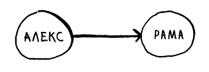
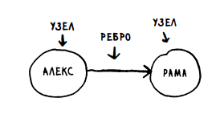

# Как работает **поиск в ширину** в Питоне / How the breadth-first search works in Python

Для понимания темы вам надо будет знать:

- что такое словарь(он же хеш-таблица) в пайтон и как он работает;
- что такое O(n);

Что такое граф?
Граф моделирует набор связей.

Например, условие
"Алекс должен Раме" можно смоделировать так:

Каждый граф состоит из узлов и ребер:

Узел может быть прямо связан с
несколькими другими узлами, которые называются соседями. Например, на графе Рама является соседом Алекса.
Однако Адит не является соседом Алекса, потому что они не связаны прямым ребром.

Алгоритм для решения задачи поиска кратчайшего пути называется
поиском в ширину.

Графы используются в алгоритме "поиск в ширину", который

- позволяет определить, существует ли путь из А в Б
- находит кратчайший путь, если путь существует
- поможет найти "кратчайшее Х"

### Пример для понимания:

Предположим, нам нужен продавец манго. Для этого мы расспрашиваем у каждого своего друга продает ли он манго
(назовем их связями первого уровня). Если
друг не продает, то мы просим у этого друга список его друзей и так с каждым своим другом. Затем мы проходимся по
каждому списку друзей, который нам дали(связи второго уровня).
Логично что связи первых уровней предпочтительнее остальных(ведь так мы быстрее найдем кратчайший путь,
поэтому первыми будут проверены как раз связи первого уровня, а затем второго

У Ануджа, Пегги, Тома и Джонни соседей нет Линии со стрелками указывают на них, но не существует стрелок от них к
другим узлам. Такой граф называется напраленным - отношения действуют только в одну сторону.

### Очередь

Если вы стоите у кассы в магазине, то вы будете первыми обслужены, а если вы последний в очереди, то последними.
Очереди чем-то похожи на стеки: вы не можете обращаться к произвольным элементам очереди.
Вам доступны лишь две операции: постановка в очередь и извлечение из очереди.

Очередь относится к категории структур данных FIFO: First In, First Out («первым вошел, первым вышел»).
А стек принадлежит к числу структур данных LIFO: Last In, First Out («последним пришел, первым вышел»).

Код написанный в main.py написан на основе примера "для понимания", 
уверен ты сможешь разобраться в коде.

Обучающий материал был создал с помощью книги "Грокаем Алгоритмы".

В книге описан пример очереди с
автобусной остановкой, но в России бабушкам плевать на очереди-они не в системы,
поэтому я привел пример кассы в магазине.

