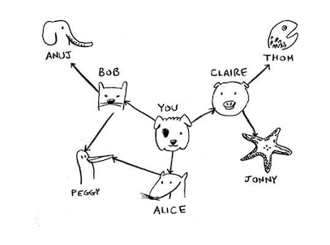

# Как работают **графы** в Питоне
# How the graph works in Python

Важен ли порядок добавления пар "ключ-значение"? Нет, не важно. В хеш-таблицах элементы не упорядочены, поэтому 
добавлять пары "ключ-значение" можно в любом порядке.

У Ануджа, Пегги, Тома и Джонни соседей нет Линии со стрелками указывают на них, но не существует стрелок от них к 
другим узлам. Такой граф называется напраленным - отношения действуют только в одну сторону. 

